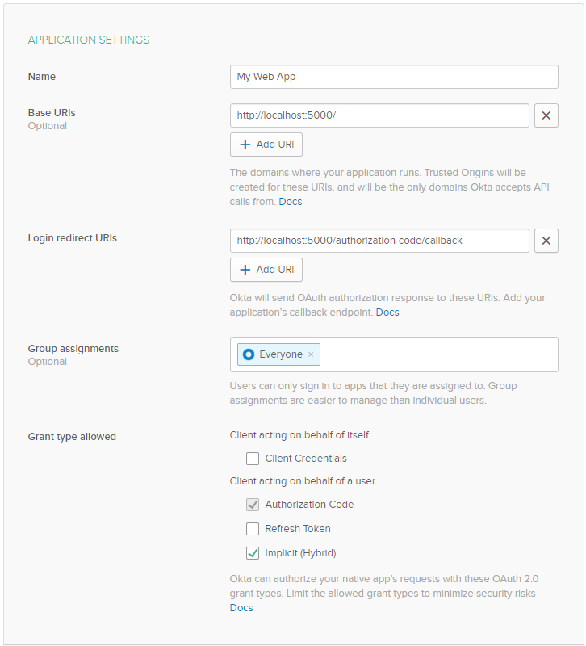
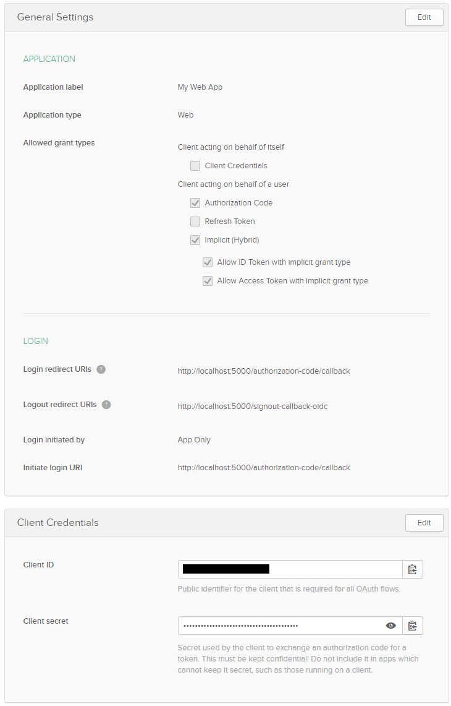
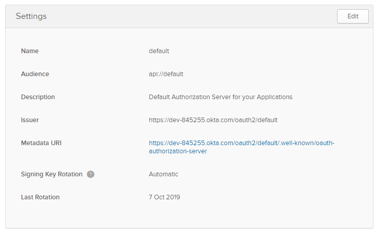
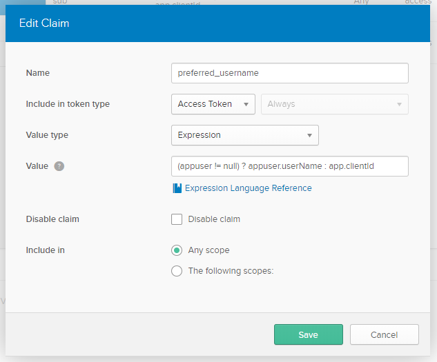

# Openid Connect with Okta

[Okta](https://www.okta.com) is an external identity provider service. It can be used to authenticate and authorize users and more. In the [`OidcWebExample`](../Src/OidcWebExample) Okta is used as an Openid Connect Provider to signin/signout the user and retrieve an access token with which the smart-me API can be accessed.

## How to setup Openid Connect in Okta

1. Create a developer account [here](https://developer.okta.com/) and login to the developer console.

2. Add some users under _Users/People_. These users also have to exist in the smart-me cloud. Specifically the username (e-mail address) has to match.

3. Add an application under _Applications_.
    1. Select _Web_ for the [`OidcWebExample`](../Src/OidcWebExample)
    2. Use the following settings:
        * Name: My Web App
        * Base URIs: http://localhost:5000/
        * Login redirect URIs: http://localhost:5000/authorization-code/callback
        * Group assignments: Everyone
        * Grant type allowed: Check _Authorzation Code_ and _Implicit (Hybrid)_

       

    3. The general settings of your application should look like the screenshot below now. Copy _Client ID_ and _Client secret_ and put them into the Oidc section in [`appsettings.json`](../Src/OidcWebExample/appsettings.json).

       

    4. Add your users in the _Assignments_ tab.

4. The smart-me API expects the claim _preferred_username_ which must be the e-mail address of the user. Okta does not provide this claim by default. Go to _API/Authorization Servers_ and edit the default authorization server.

    1. From the _Settings_ tab copy the _Issuer_ and put it as _Authority_ into the Oidc section in [`appsettings.json`](../Src/OidcWebExample/appsettings.json).

        

    2. In the _Claims_ tab add a new claim. Use the following settings:
        * Name: preferred_username
        * Include in token type: Access Token
        * Value type: Expression
        * Value: (appuser != null) ? appuser.userName : app.clientId
    
        The claim should look like this now:

        